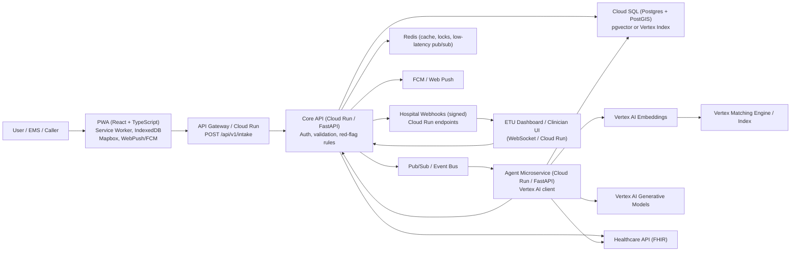
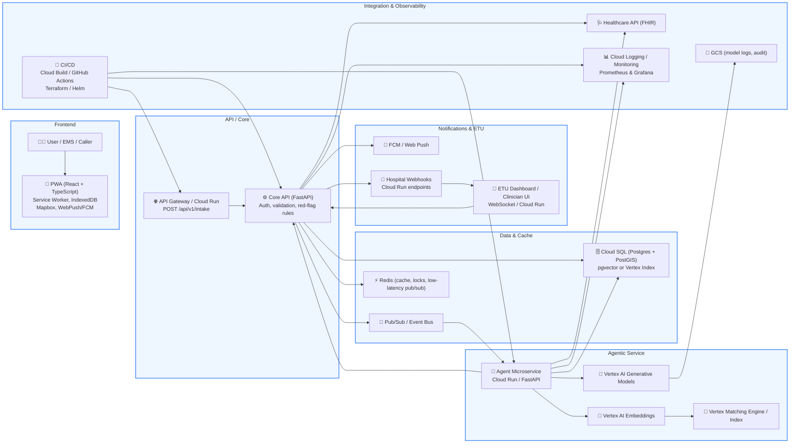

# Autonomous Routing & Alerting System — Summary

Date: 2026-05-29

This file captures the full conversation history, architecture recommendations, business flow, technology choices, and UX design discussed for the Agentic emergency routing and notification platform.

---

## Problem Statement

The lack of anticipatory patient information/symptoms prior to arrival creates severe operational bottlenecks that hinder a smooth and fast admission process in Emergency Treatment Units (ETUs), resulting in critical delays to life-saving care.

## Goal

Build an Agentic, progressive web application (PWA) that captures symptoms before arrival, uses an Agent (LLM + retrieval) to triage and match destinations, and sends structured pre-arrival notifications to ETUs so clinicians can prepare.

## Rationale
- Intelligent, symptom-driven destination matching prevents routing patients to overwhelmed or unequipped hospitals.
- Pre-arrival structured context allows ETUs to shift from reactive admission to anticipatory preparation.
- The system reduces entry congestion and accelerates delivery of life-saving interventions.

---

## Architecture Summary

### High-level architecture
- Frontend: responsive web PWA, offline support, notifications, maps.
- Backend core: API Gateway and Core API for auth, validation, triage, and routing.
- Event bus: Pub/Sub or Kafka for reliable async ingestion and delivery.
- Storage: Postgres + PostGIS for clinical and geospatial data, Redis for cache and pub/sub.
- Agentic service: Vertex AI for embeddings and generative reasoning.
- Notifications: FCM, Web Push, signed hospital webhooks.
- ETU dashboard: clinician UI with real-time acknowledgement via WebSockets.
- Integration: Healthcare API / FHIR for downstream EHR connectivity.

### Key principles
- Progressive enhancement
- Offline-first experience
- Secure, privacy-aware design
- Auditability for model and PHI events
- Human-in-the-loop on low-confidence / high-risk decisions
- Clear service boundaries for mixed backend stack

---

## Technology Stack Recommendation

### Frontend
- React + TypeScript (Vite) for the PWA.
- Tailwind CSS or MUI for styling.
- Mapbox GL JS or Google Maps for routing and ETA.
- VitePWA / Workbox for service worker and offline caching.
- Web Push (VAPID) and Firebase Cloud Messaging (FCM).
- Optional Capacitor wrapper for native packaging.
- Micro frontend pattern with Module Federation or single-spa for large teams.
- React Native as a separate mobile companion app, if native support is required.

### Backend
- Core API: FastAPI (Python) or Spring Boot (Java) for transactional and enterprise services.
- Agentic AI: Python + FastAPI for Vertex AI integration.
- Database: PostgreSQL + PostGIS for geospatial and clinical data.
- Vector search: pgvector or Vertex AI Index / Matching Engine.
- Cache: Redis for low-latency data and coordination.
- Message bus: Pub/Sub or Kafka for event-driven architecture.
- Real-time: WebSockets / Socket.IO for dashboards.

### Agentic / Vertex AI
- Vertex AI Generative Models for severity scoring and plan generation.
- Vertex AI Embeddings for context vectorization.
- Vertex Matching Engine / Index for retrieval-based matching.
- GCS or secure object storage for audit logs.
- Service account IAM with minimal Vertex AI permissions.

### Infrastructure
- Deploy on Google Cloud Run, Kubernetes, or managed compute.
- Use Cloud SQL for Postgres and managed Redis if possible.
- CI/CD: GitHub Actions or Cloud Build.
- IaC: Terraform and Helm.
- Observability: Cloud Logging, Prometheus, Grafana, Sentry.

### Security & Compliance
- OAuth2 / OpenID Connect authentication.
- TLS for all traffic.
- Secret Manager and IAM least privilege.
- Audit logs for PHI and model calls.
- Privacy-first design with minimal PHI in payloads.
- HIPAA / GDPR controls where applicable.

---

## Agentic Architecture & Technical Flow

### Ingestion and processing
1. User submits symptom intake via the PWA.
2. Core API validates, authenticates, and performs red-flag checks.
3. Intake event is published to Pub/Sub / event bus.
4. Agent microservice consumes the event.
5. Agent service computes embeddings and performs retrieval.
6. Vertex AI generative model returns severity, ranked destination list, and pre-arrival plan.
7. The results are stored in the database and returned to the Core API.
8. Notifications are delivered to ETUs, EMS, and patient/browser.
9. ETU dashboard updates in real time and acknowledges or rejects the case.
10. Outcome and feedback data are used for continuous learning.

### Detailed technical flow
- The PWA sends `POST /api/v1/intake` to the API gateway.
- The Core API handles idempotency and publishes to the event bus.
- The Agent service performs Vector + RAG retrieval, invokes Vertex AI, and persists decisions.
- The Core API sends notifications through FCM/Web Push and secure hospital webhooks.
- ETU dashboard receives the case and updates status through real-time channels.
- FHIR integration is used for hospital EHR interoperability.

---

## Frontend Architecture

### Component structure
- `SymptomIntake`
- `MapRouting`
- `ETUDetail`
- `PreArrivalTasks`
- `ClinicianDashboard`
- `ChatbotAssistant`

### State management
- Redux Toolkit or Zustand.
- Store symptom drafts, ETU candidates, agent state, offline queue, auth.
- Use selectors for derived state such as ETA and route ranking.

### Offline / PWA features
- Service Worker with cache strategies.
- IndexedDB via LocalForage for drafts and queued submissions.
- Background sync for offline retry.
- Installable manifest and responsive layout.

### Agent integration
- Small client SDK for agentic API calls.
- Send structured symptom payloads and receive decision packages.
- Display model confidence and allow clinician override.

---

## Business Process Flow

### User journey
1. User lands on the mobile welcome screen.
2. The app offers large emergency buttons and an agentic chatbot entry.
3. If unsure, the user selects `Help Me Decide` and interacts with the chatbot.
4. The chatbot collects symptoms conversationally.
5. Structured intake data is generated and submitted.
6. The Agent evaluates urgency and ETU suitability.
7. The system selects the best destination and generates pre-arrival instructions.
8. Notifications are delivered to the ETU and EMS.
9. The ETU accepts or rejects, and resources are prepared.
10. Arrival is confirmed and handoff occurs.
11. Outcomes are captured for continuous improvement.

### Decision points
- Immediate emergency bypass for critical red-flag symptoms.
- Agent confidence threshold to trigger human review.
- ETU rejection causes re-routing and new notification.
- Minimal PHI in initial payloads.

### SLAs
- Intake ack: < 2 seconds.
- Agent recommendation: < 5 seconds for async response.
- Notification delivery: < 10 seconds.
- Re-route decision after rejection: < 15 seconds.

---

## Mobile Welcome Screen UX

### Recommended system entry
- Start with a mobile landing page that includes:
  - Welcome message
  - emergency quick-action buttons
  - agentic chatbot button
  - local language support

### Emergency buttons for Sri Lanka
- `Ambulance` / `ඇම්බුලන්ස්` / `அம்புலன்ஸ்`
- `Chest Pain / Heart` / `හෘද වේදනාව` / `மாரடைப்பு`
- `Breathing Trouble` / `ශ්වසන අපහසුතාව` / `சுவாசம் கடும்`
- `Accident / Injury` / `දිවාපත / රබර` / `அத்தாட்சிப்`
- `Stroke / Weakness` / `ස්ට්‍රෝක් / දුර්වලතාව` / `ஸ்ட்ரோக்`
- `Pregnancy Emergency` / `ගර්භණී තත්ත්වය` / `கர்ப்ப கால அவசரம்`
- `Help Me Decide` / `මට උදව් කරන්න` / `எனக்கு உதவி செய்ய`

### UX behavior
- Large, easy-to-tap buttons.
- Local language and icons.
- Visible emergency number and quick action.
- Agentic chat available for uncertain cases.
- Emergency bypass for critical conditions.

---

## Micro Frontend and Mixed Backend Approach

### Frontend
- Micro frontends for the PWA with Module Federation or single-spa.
- Shared design system for consistency.
- Separate React Native mobile app if native is required.

### Backend
- Spring Boot for transactional core services and enterprise integration.
- Python + FastAPI for Agentic AI and Vertex AI orchestration.
- Clear APIs and event-driven messaging between services.

---

## Entry Point API Contract

### Endpoint
`POST /api/v1/intake`

### Required headers
- `Authorization: Bearer <token>`
- `Content-Type: application/json`

### Example payload
```json
{
  "request_id": "uuid-v4",
  "submitted_by": { "type": "patient", "id": "optional" },
  "location": { "lat": 12.34, "lng": 56.78 },
  "symptoms": [{ "code": "S001", "onset": "2026-05-29T12:34:00Z", "severity": 4 }],
  "free_text": "chest tightness and shortness of breath",
  "consent": true,
  "device_meta": { "platform": "web", "app_version": "0.1.0" }
}
```

---

## Mermaid Architecture Diagram

### Basic architecture



### Enhanced diagram with icons



---

## Notes
This `summary.md` is the fresh consolidated record of the chat history, architecture design, system flow, and UX details through the welcome screen discussion.
'@
