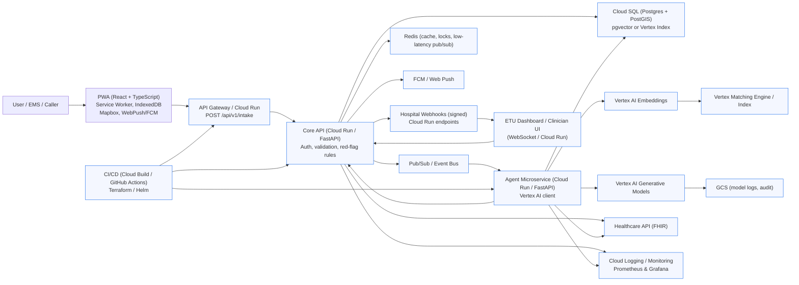
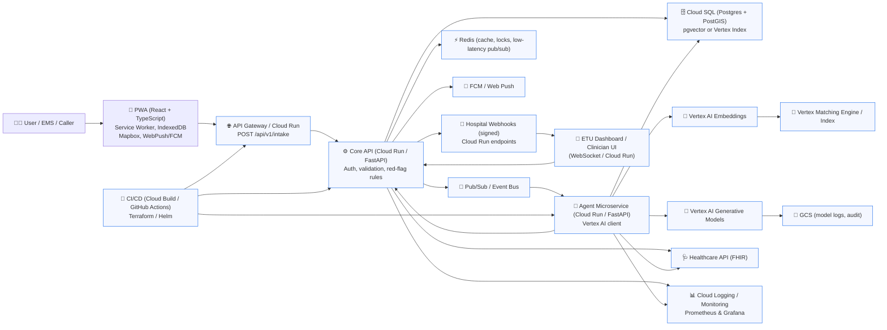

# etu-genai

# Autonomous Routing & Alerting System — Design Summary

Date: 2026-05-29

This document captures the discussion, architecture decisions, and artefacts produced so far for the Agentic PWA that provides symptom-driven pre-arrival notifications to Emergency Treatment Units (ETUs).

---

## Problem Statement

The lack of anticipatory patient information/symptoms prior to arrival creates severe operational bottlenecks that hinder a smooth and fast admission process in Emergency Treatment Units (ETUs), resulting in critical delays to life-saving care.

## Goal

Build an Agentic, progressive web application (PWA) that captures symptoms before arrival, uses an Agent (LLM + retrieval) to triage and match destinations, and sends structured pre-arrival notifications to ETUs so clinicians can prepare.

## Rationale (summary)
- Intelligent, symptom-driven destination matching avoids routing patients to overwhelmed or unequipped facilities.
- Pre-arrival context (structured symptom data + confidence) lets ETUs prepare resources ahead of arrival, changing the workflow from reactive to anticipatory.

---

## High-level Architecture

Actors: Patient/Caller, PWA (mobile/web), Core API, Agent microservice (Vertex AI), Event Bus (Pub/Sub), Datastore (Postgres+PostGIS), Cache (Redis), Notification channels (FCM/Web Push), ETU Dashboard, EHR/FHIR integration.

Key principles: progressive enhancement, offline-first, security & privacy, auditable agent calls, human-in-the-loop for low-confidence or high-risk cases.

---

## Technology Choices (finalized / recommended)

- Frontend: React + TypeScript (Vite) with VitePWA; Tailwind CSS or MUI; Mapbox GL JS (or Google Maps); Web Push (VAPID) + FCM; optional Capacitor wrapper.
- Backend Core API: FastAPI (Python) on Cloud Run (or NestJS if TypeScript preferred).
- Database: Cloud SQL / PostgreSQL + PostGIS; pgvector for local vector storage (or Vertex Index / Pinecone for managed vector indexing).
- Agentic service: Python + FastAPI microservice calling Vertex AI (Generative + Embeddings); host on Cloud Run.
- Eventing: Google Cloud Pub/Sub for ingestion and fan-out (or Kafka for on-prem/high-throughput).
- Real-time: WebSockets / Socket.IO for ETU dashboards; Redis for low-latency pub/sub and locks.
- Notifications: Firebase Cloud Messaging (FCM) and Web Push; hospital webhooks (signed JWT) to ETU endpoints.
- Orchestration: Cloud Tasks / Workflows or Temporal for durable, retryable agent flows.
- Observability: Cloud Logging / Prometheus + Grafana; store model call logs to secure GCS for audit.
- CI/CD / Infra: GitHub Actions or Cloud Build, Terraform, Helm charts for K8s.
- Security & Compliance: OAuth2/OIDC, TLS, Secret Manager, IAM roles, Cloud Audit Logs, HIPAA BAA as required.

MVP fast path: React+Vite PWA, FastAPI agent + Cloud Run, Cloud SQL (Postgres + pgvector), Vertex AI for LLM + embeddings, FCM + Web Push.

---

## Agentic Design (Vertex AI)
- Use Vertex AI Generative Models (text-bison or current) for plan generation and classification.
- Use Vertex AI Embeddings + Vertex Index / Matching Engine for retrieval (or pgvector/Pinecone for MVP).
- Build an Agent microservice that: accepts symptom payloads, computes embeddings, retrieves context, calls Vertex generative model to produce severity, ranked ETU list, and a pre-arrival task list.
- Keep audit logs of model inputs & outputs (GCS, Cloud SQL links), record model confidence, and include rule-based fallbacks.

IAM: service account with minimal roles e.g., `roles/aiplatform.user` and access to GCS and Pub/Sub.

---

## Frontend Architecture (detailed)
- Component-based React structure: pages such as `SymptomIntake`, `MapRouting`, `ETUDetail`, `PreArrivalTasks`, `ClinicianDashboard`.
- State management: Redux Toolkit or Zustand for global state (symptom drafts, candidate ETUs, agent task states, offline queue).
- Offline & PWA: Service Worker + Background Sync; IndexedDB (LocalForage) for drafts and queued notifications.
- Agent bridge: small client SDK to call Core API endpoints; show model confidence and allow clinician override.
- Security: OAuth2/OIDC flows, local encryption for stored sensitive fields when required.

Folder layout suggestion:
```
src/
  api/
  components/
  features/
  hooks/
  state/
  services/ (agent-client, push-client, idb)
  sw/ (service worker)
  App.tsx
  main.tsx
```

---

## Business Process Flow (end-to-end)
1. Symptom Capture: Patient/caller completes guided symptom intake on PWA (structured codes + free text + location + consent).
2. Local Triage: App runs rule-based red-flag checks to immediately instruct emergency actions if needed.
3. Submit & Enqueue: App submits to `POST /api/v1/intake`; Core API enqueues event to Pub/Sub and returns ack.
4. Agentic Analysis: Agent microservice consumes event, computes embeddings, performs RAG, runs generative model to produce severity, ranked ETUs, recommended pre-arrival tasks.
5. Destination Selection & Escalation: Agent picks top ETU; low-confidence or high-risk triggers human-in-loop.
6. Notify Stakeholders: Core API sends pre-arrival notification to ETU (webhook + dashboard), pushes to EMS/patient (FCM/WebPush).
7. ETU Acknowledgement & Prep: ETU accepts/rejects; acceptance triggers resource allocation.
8. Real-time Updates: ETA or status updates flow to Core API → Agent recalculates → ETU & EMS updated.
9. Arrival & Handoff: Final packet and audit trail delivered; handoff performed.
10. Outcome & Feedback: ETU records outcome; data used to retrain models and update metrics.
11. Auditing & Compliance: All model calls, notifications, and PHI handling logged and access-controlled.

Decision rules: immediate red-flags bypass agent; HIL threshold for low confidence; re-route SLA for ETU rejection.

SLA examples: ack <2s, agent recommendation <5s (async acceptable), notification delivery <10s, re-route <15s.

---

## Entry Point (API Contract)
- Canonical programmatic entry: `POST /api/v1/intake` (API Gateway / Cloud Run)
- Requirements: `Authorization: Bearer <token>`, `request_id` for idempotency.

Example request body (JSON):

```json
{
  "request_id": "uuid-v4",
  "submitted_by": { "type": "patient", "id": "optional" },
  "location": { "lat": 12.34, "lng": 56.78 },
  "symptoms": [{ "code": "S001", "onset": "2026-05-29T12:34:00Z", "severity": 4 }],
  "free_text": "chest tightness and shortness of breath",
  "consent": true,
  "device_meta": { "platform": "web", "app_version": "0.1.0" }
}
```

Server responsibilities on receipt: immediate red-flag check, enqueue event, persist intake metadata, trigger async agent workflow.

---

## Epics (from earlier)
- Symptom Intake & PWA
- Immediate Triage & Red‑Flag Handling
- Agentic Analysis & Decisioning (Vertex AI)
- Destination Matching & Routing
- Pre‑Arrival Notification & Delivery
- ETU Dashboard & Clinician Workflow
- Real‑time Updates & Transport Coordination
- Data Integration & EHR/FHIR Connectivity
- Security, Privacy & Compliance
- Observability, Metrics & Continuous Learning
- Admin, Configuration & Hospital Onboarding
- CI/CD, Testing & Deployment Automation

---

## Current TODO (project plan)
- Define requirements & constraints — Completed
- Select frontend stack — Completed
- Select backend stack & infra — In progress
- Design data & integrations — In progress
- Implement real-time & notifications — Not started
- Security & compliance — Not started
- CI/CD, testing & observability — Not started

---

## Mermaid Architecture Diagrams

Basic solution architecture (paste into Mermaid/eraser):



Enhanced (emoji/icons) Mermaid diagram:



> Note: If you prefer real SVG brand icons instead of emojis, we can embed image URLs, but some Mermaid renderers (or Eraser) may require `securityLevel` adjustments or HTML allowance.

---

## Next recommended steps
- Confirm choice of backend language (FastAPI vs NestJS) and whether Cloud Run / Kubernetes will be used.
- Scaffold a minimal repo: React PWA + Core API `POST /api/v1/intake` + Agent microservice stub calling Vertex AI.
- Implement secure auth (OIDC) and a simple ETU dashboard stub with WebSocket acks.

If you want, I can scaffold the MVP repo (files + minimal runnable example) next.

---

## Conversation artifacts
- API contract examples, mermaid diagrams (above), todo list state, epics and decision rules are included in this document.


*End of summary.*


